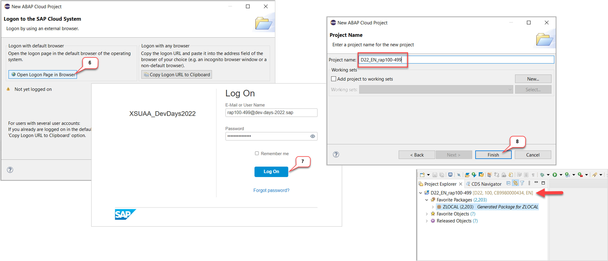
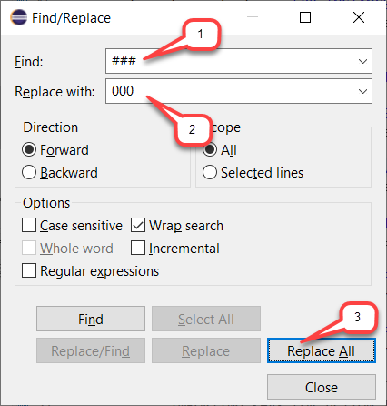

[Home - RAP110](../../README.md)

# Exercise 0: Getting Started

## Introduction

---
> ⚠ **PLEASE NOTE**:    
>  
> Participants of **DSAG ABAP Development Days** will receive logon information - i.e. user credentials and group ID - to a dedicated SAP BTP ABAP environment system from the SAP team via email prior to the event.
> 
> You will find the solution for this workshop in the development package **`ZRAP110_SOL`**. 
> 
> Please inform the SAP staff during the event if you have not received the logon information. 
---

- [Group ID](#group-id)
- [Create an ABAP Cloud Project in ADT](#create-an-abap-cloud-project-in-adt) 
- [Create an ABAP Project in ADT](#create-an-abap-project-in-adt)
- [Helpful Information](#helpful-information)
  - Find/Replace
  - ABAP Pretty Printer
  - Modern ABAP Syntax
  - Useful ADT Shortcuts
- [Summary](#summary)

> **Note:**    
> The screenshots in this document have been taken using group ID **`810`** and system **`D23`**. We **do not recommend** using group ID **`810`** or **000***.
> 
> Please note that ADT dialogs and views as well as Fiori UIs may change in upcoming releases.

## Requirements
[^Top of page](#)

In order to participate in this hands-on session you MUST have installed the latest version of Eclipse and the latest version of the ABAP Development Tools (ADT) in Eclipse.  

Please check the following two short documents how to do this if you have not already done it:  
- [Install the ABAP Development Tools (ADT)](https://developers.sap.com/tutorials/abap-install-adt.html)  
- [Adapt the Web Browser settings in your ADT installation](https://github.com/SAP-samples/abap-platform-rap-workshops/blob/main/requirements_rap_workshops.md#4-adapt-the-web-browser-settings-in-your-adt-installation)  

## Group ID
[^Top of page](#)

You've already received your **group ID** and **user credentials** for the dedicated SAP BTP ABAP environment system from the SAP team via email prior to the event. It can also be derived from your user email: **developer-###@devdays2023.sap**, where **###** is your Group ID.

Use the group ID (**###**) assigned to you by the SAP team in the different exercises of this workshop.

Please inform the SAP staff during the event if you have not yet received the email (_xxxx@sap.com_) - or check your _junk mail_ or _spam_ folder. 

## Create an ABAP Cloud Project in ADT
[^Top of page](#)

> Create an **ABAP Cloud Project** in your ADT installtion to create a connection to the SAP BTP ABAP Environment system, aka Steampunk.

> ⚠ **DSAG ABAP Development Days 2023**: Use the Service Key for the System D23 available on [the Event Share](https://sap-my.sharepoint.com/personal/carine_tchoutouo_djomo_sap_com/_layouts/15/onedrive.aspx?ga=1&id=%2Fpersonal%2Fcarine%5Ftchoutouo%5Fdjomo%5Fsap%5Fcom%2FDocuments%2FDSAG%20ABAP%20Development%20Days%20Edition%202023%2FTag%201%2FHands%2Don%2DUnterlagen&view=0).

  
🔵 Click to expand!

   
1. Open the **ABAP** perspective if not yet done.

    

2. Now create the **ABAP Cloud Project** as shown on the screenshots provided below. 

    

    

## Helpful Information
[^Top of page](#)

> This section contains some helpful information for the exercises: _Find/Replace_ functionality, modern ABAP syntax, and useful ADT shortcuts.

  
🔵 Click to expand!

 
### Find/Replace

In the course of these exercises you will frequently see the task to "_replace the placeholder **`###`** with your group ID_", where *###* is your group ID. 

For this it's recommended to make use of the **Find/Replace** feature of the Eclipse Editor. It can be opened either via the menu (**_Edit -> Find/Replace..._**) or via **Ctrl+F**.
  
 
   
Choosing **Replace All** allows you to replace all ocurrences of **`###`** with your group ID.

### ABAP Pretty Printer (ABAP Formatter)

For this make use of the shortcut **`Shift + F1`**

### Modern ABAP Syntax

The modern, declarative, and expression-oriented ABAP language syntax will be used in the different exercises. It allows developers to write more simple and concise source code using new language features like inline declarations, constructor expressions.

> **Find more information in the ABAP Keyword Documentation**: [ABAP - Programming Language](https://help.sap.com/doc/abapdocu_cp_index_htm/CLOUD/en-US/index.htm?file=abenabap_reference.htm) 

  
### Useful ADT Shortcuts

Here are some useful ADT keyboard shortcuts for the ABAP development in Eclipse.

More useful ADT shortcuts can be found here: [Link](https://blogs.sap.com/2013/11/21/useful-keyboard-shortcuts-for-abap-in-eclipse/).

> **Info**: You can display the full list of available shortcuts in the **Show Key Assit** in ADT by pressing **Ctrl+Shift+L**.
 

## Summary 
[^Top of page](#)

You can continue with the next exercise - **[Exercise 1: Inspect your Exercise Package - RAP BO & Business Service](../ex01/README.md)**

---
