[Home - RAP610](../../../../#exercises)

# Exercise 1: Find and examine a released RAP BO

## Introduction

In this exercise, you will search for a released RAP business object to create a purchase requisistion. For this we will add an appropriate *ABAP repository tree* to the *Project Explorer* in your ADT.

We will continue to create a simple class to investigate 

- How ABAP cloud restricts the use of not released APIs
- How ABAP cloud restricts the use of outdated ABAP statements that are not part of the ABAP language version *ABAP for Cloud Development*   

We will then use this class to build a test class to call the released API **I_PurchaseRequisitionTP** before starting to build our own RAP BO that shall serve as an UI for an OnlineShop Application.  
 

- [1.1 - How to find a released API using an ABAP repository tree](#exercise-11-how-to-find-a-released-api-using-an-abap-repository-tree)
- [1.2 - Create a package with language version "ABAP for Cloud Development"](#exercise-12-create-package-with-language-version-abap-for-cloud-development) (Not for participants of SAP events)  
- [1.3 - Test ABAP Cloud restrictions](#exercise-13-create-a-class-to-test-abap-cloud-governance)
- [1.4 - How to identify local API's for SAP S/4HANA Cloud via Github ](#exercise-14-identifying-local-apis-for-s4hana-cloud-via-github)
- [1.5 - Check the documentation of i_purchaserequisitiontp](#exercise-15-check-the-documentation-for-i_purchaserequisitiontp)
- [1.6 - Implement a test class to call I_PurchaserequisitionTP ](#exercise-16-implement-a-test-class-to-call-i_purchaserequisitiontp)
- [Summary](#summary)
- [Appendix](#appendix)

> **Reminder:**   
> Don't forget to replace all occurences of the placeholder **`###`** with your group ID in the exercise steps below.  
> You can use the ADT function **Replace All** (**Ctrl+F**) for the purpose.   
> If you don't have a group ID yet, then check the section [Getting Started - Group ID](../ex0/readme.md#group-id).    

## Exercise 1.1: How to find a released API using an ABAP repository tree  
[^Top of page](#)

In this exercise we will learn how to find a released API in the application component hierarchy.  
For this we will use an ABAP Repository Tree which allows for displaying a filtered selection of development objects in the Project Explorer of the ABAP Development Tools (ADT).   
The application component hierarchy contains all objects of the entire system. Structuring is done by application component, package and object type. 
Here we have later to add additional filters that restrict the search to 
- objects that are released: **API:USE_IN_CLOUD_DEVELOPMENT**  
- objects of type behavior definition: **TYPE:BDEF**    

 

  
Click to expand!

  1. In the Project Explorer, right-click on your ABAP Project and choose New -> ABAP Repository Tree...

  . 

  2. In the Create Tree dialog, choose **Appliction Component Hierarchy** as filter criterion and click the **Next >** button.

  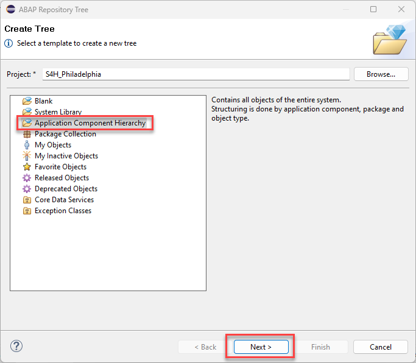  
 

  3. Since we are only interested in released objects and in behavior definitions, we place the cursor in the input field **Property Filter** and press **Ctrl + Space** to use the *Content Assit* to open the list of object types.   
 
 Double-click on **API:** and then again press **Ctrl + Space** to get a list of API states. Here we navigate to **USE_IN_CLOUD_DEVELOPMENT** and double-click on this entry so that the entry in the property filter text box now reads **api:use_in_cloud_development**.  

Then add a **blank** behind the filter statement and and press again **Ctrl + space**.  This time we double-click on **TYPE:** and after having pressed again  **Ctrl + Space** we double-click on **BDEF**.  
  
  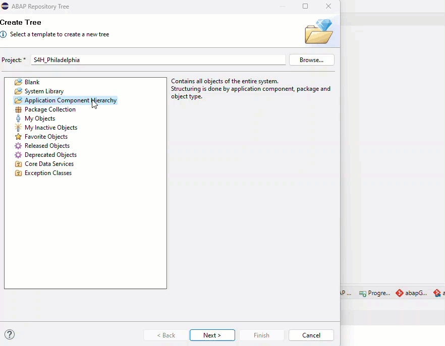 

  The entry in the property filter text box now reads as follows: **api:use_in_cloud_development type:bdef**   
 
  Rename tree name to **Application Component Hierarchy filtered by API state and object type (BDEF)** and the press **Finish**.     

    
 
  3. Check the content of the ABAP repository tree that you have created and navigate to the application component **MM-PUR-REQ**.  Here we find the name **I_PurchaseRequisitionTP** of a released API to create purchase requisitions.   

   

  > When you create another ABAP repository tree based on the *Application Hierarchy* template and use the filter `TYPE:TRAN` to display classic dynpro transactions you will find 5 transactions in the application component **MM-PUR-REQ** such as **ME51N**, **ME52N** and **ME53N** which can be used to create, update and display purchase requisitions.   

  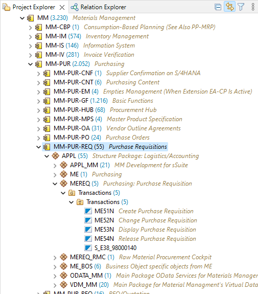 

  4. Checking out released API's in SAP S/4HANA Cloud we see that the number of released API's is growing. The following screen shot shows the data from an SAP S/4HANA Cloud 2302 system.

  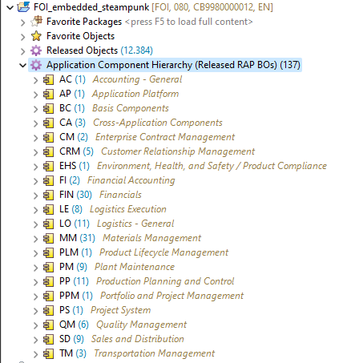   

  >**Hint:**    
  > The filter `api:` or `type:`can also be applied in the dialog *Open ABAP Development Object*. Press **Ctrl + Shift + A** to open this dialog.  
  > In the following example, the filter `api:` is being used to find CDS views (filter `type:DDLS`) with name pattern `I_SALES` which were released as APIs for use in key user apps (filter api:USE_IN_KEY_USER_APPS):

  > 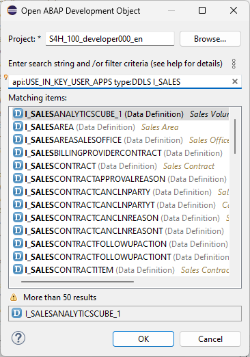 
    

 
 

 
## Exercise 1.2: Create Package with language version ABAP for Cloud Development
[^Top of page](#)

> Create your exercise package .   
> This ABAP package will contain all the artefacts you will be creating in the different exercises of this hands-on session.

> **Note:**  
> In SAP led hands-on workshops it might be that a package `Z_ONLINESHOP_###` has already been created for you.  
> In this case you can continue with [Excercise 1.3](#exercise-13-create-a-class-to-test-abap-cloud-governance).      
 
 

  
Click to expand!

   1. In ADT, go to the **Project Explorer**, right-click on the folder **`Favorite Packages`**, and select **Add Package** from the context menu. 

   .

   2. In the search dialogue start to type **ZLOCAL** and select the entry **ZLOCAL** from the result list.

   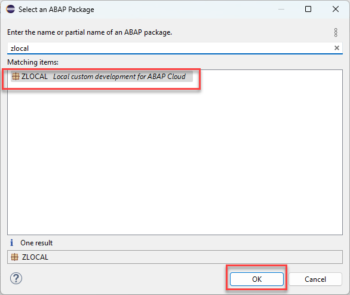.
   
   2. In ADT, again the **Project Explorer** right-click on the package **`ZLOCAL`**, and select **New** > **ABAP Package** from the context menu. 

   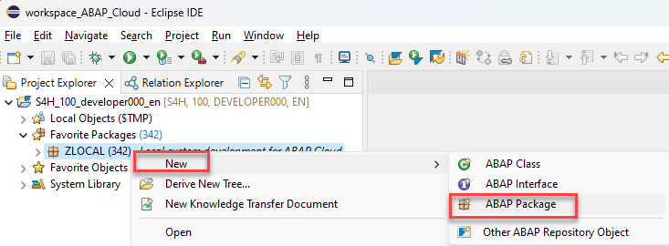
   
   3. Maintain the required information (`###` is your group ID):
       - Name: **`Z_ONLINESHOP_###`**
       - Description: _**`Online Shop ###`**_
       - Select the box **Add to favorites package**
       
      Click **Next >**.

   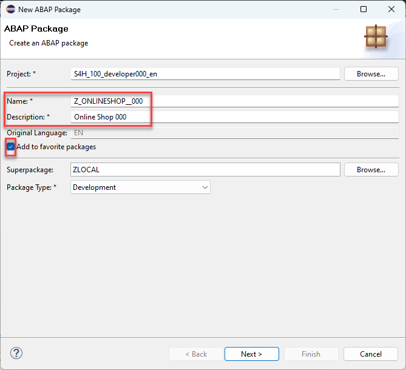.

   4. Do not enter an Application Component and press **Next**

   .

   5. Create a new transport request, maintain a description (e.g. _**Online Shop Package ###**_), and click **Finish**.
      
   .

   6. You should now see your new package in your *Project Explorer*

   .

   7. Check the language version of your package

      As you can see your package has the superpackage `ZLOCAL`. This is a structure package that is part of the software component `ZLOCAL` which is configured for the use of **ABAP for Cloud Development** and the **Local Objects**. 

      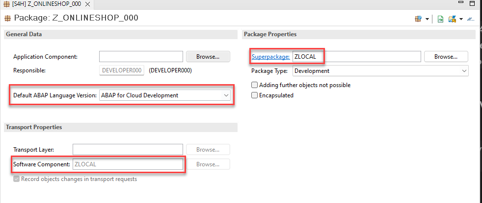.

## Exercise 1.3: Create a class to test ABAP Cloud governance
[^Top of page](#)

> Create a class to test the effects of using the language version *ABAP for Cloud Development*.   

 

  
Click to expand!

   1. Right-click on your ABAP package **`z_online_shop_###`** and select **New** > **ABAP Class** from the context menu.

      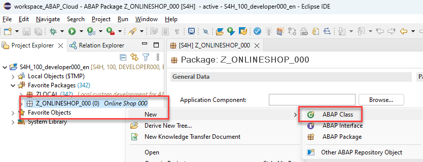. 
  
   3. Maintain the required information (`###` is your group ID).
      - Name: **`zcl_test_i_purchase_req_###`**
      - Description: _**`Test Purchase Req API I_PurchaserequisitionTP`**_                  

      Click on **Add** and select the interface `if_oo_adt_classrun`. 

      and click **Next >**

      . 

   4. Select a transport request, and click **Finish** to create the class.

   
   5. Copy the code snippet provided below and add it in the implementation section of the methode `main`. 
 
      > **Hint**: Hover the code snippet and choose the _Copy raw contents_ icon  appearing in the upper-right corner to copy it. 
      
 <pre lang="ABAP">
   METHOD if_oo_adt_classrun~main.
  
    CALL FUNCTION 'POPUP_TO_CONFIRM'.

    select single * from MARA where matnr = '1234' into @data(material_info).

    call function 'BAPI_PR_CREATE'
*  EXPORTING
*    prheader               = 
*    prheaderx              = 
*    testrun                = 
*  IMPORTING
*    number                 = 
*    prheaderexp            = 
*  TABLES
*    return                 = 
*    pritem                 = 
*    pritemx                = 
*    pritemexp              = 
*    pritemsource           = 
*    praccount              = 
* ...

  .

    SELECT * FROM EBAN WHERE banfn = '0010001516' INTO TABLE @DATA(purchase_req_data_from_eban).

    SELECT * FROM  I_PURCHASEREQUISITIONITEMAPI01 WHERE PurchaseRequisition = '0010001516' INTO TABLE @DATA(purchase_req_data).
  ENDMETHOD.

ENDCLASS.
 </pre>

      The ABAP class `zcl_test_i_purchase_req_###` in the screenshot underneath uses the ABAP Cloud development model (ABAP language version “ABAP for Cloud development”). The class cannot be compiled because of two ABAP statements containing syntax-errors:

      - Line 17: The SAP function module `POPUP_TO_CONFIRM` is used in the classic Dynpro/SAP GUI world and is no public SAP API in the ABAP Cloud development model.  
  
      - Line 19: Direct access to SAP table `MARA` is also not allowed. Here (in 2022) the devloper gets **no** hint which public API to use instead.
  
      - Line 21: The use of the SAP function module `BAPI_PR_CREATE` is also forbidden in the ABAP Cloud development model, but for this function module a successor is available, namely the Behavior Definition `I_PURCHASEREQUISITIONTP` which is mentioned in the error message.   
  
      - Line 41: Direct access to SAP table `EBAN` is also not allowed. Here (in 2022) the devloper already gets a hint to use the public CDS view `I_PURCHASEREQUISITIONITEMAPI01` instead.
  
      - Line 43: Valid access to CDS view `I_PURCHASEREQUISITIONITEMAPI01`. 
             
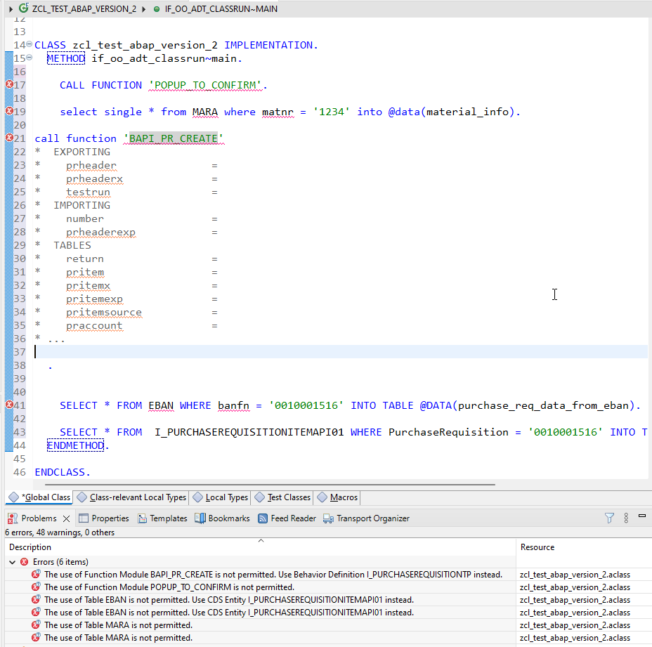. 
      
   6. The effect of the release state **Not to Be Released** in combination with a successor is illustrated below for the table `EBAN`, which was replaced by the CDS view `I_PURCHASEREQUISITIONITEMAPI01`. When you open an object such as `EBAN` for which a success is maintained you see this information also in the **Properties** in ADT where you have the option to conveniently navigate to the successor object.   
   
   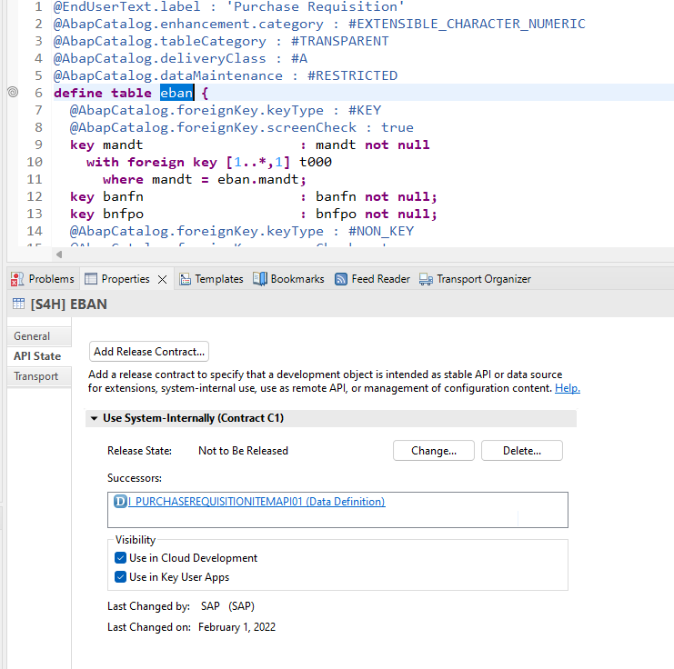. 
  
  7. What you can do if the use of an object is not permitted but now successor has been maintained in the current release is described in the following exercise. 

 
## Exercise 1.4: Identifying local APIs for S/4HANA Cloud via GitHub   
[^Top of page](#)

While developing an ABAP Application for S/4HANA Cloud, you do get the following error message: "Use of <Object Type> <Object Name> is not permitted". But the error message does not provide a hint which API or object to use instead. The reason is that the successor information in on premise system does not contain the latest updates such as in SAP S/4HANA Cloud, ABAP Environment systems.   

An example would be the table `MARA` in the on premise release 2022.  

 You as a developer nevertheless want to find out which objects to use intstead and to check their documentation.   

 

  
Click to expand!

  
  1. Check out the GitHub repository. 
  
     The repository contains the list of released APIs of S/4HANA Cloud. In addition also the objects that are not released are contained with the specification of successor objects. All objects are contained in one JSON file. This file is used as content for the ABAP Test Cockpit Check "Usage of Released APIs (Cloudification Repository)". This check can be used by customers and partners to analyse existing custom code concerning the usage of released and not released APIs on all ECC and S/4HANA releases. The check is available in SAP BTP, ABAP environment.
     
     [S/4 HANA Cloud - Released objects for ATC Check (Cloudification Repository)](https://github.com/SAP/abap-atc-cr-cv-s4hc).
     
 When we check the **csv file** that is public available we can retrieve a list of successors for the table MARA.  
 
   
 
 And we can identify additional released API's from the purchase requisition area.   
 
   
  
 While csv files are nice for human beings, computers prefer json files.  
 
 [Link to json sample file](https://raw.githubusercontent.com/SAP/abap-atc-cr-cv-s4hc/main/src/objectReleaseInfo_2208.json) 
  
 
  

## Exercise 1.5: Check the documentation for I_PurchaseRequisitionTP
[^Top of page](#)

The documentation for a released RAP business object can be found in so called **Knowledge Transfer Documents** which have the same name as the business object (released API) it describes.     

 

  
Click to expand!

  1. You can find the **Knowledge Transfer Document** of a realeased API in the folder **Documentation** underneath the business object in the Project Explorer.
  It can also be opened from within the source code editor of your behavior definition. Here you find the link at the top of the source code of the behavior definition.

  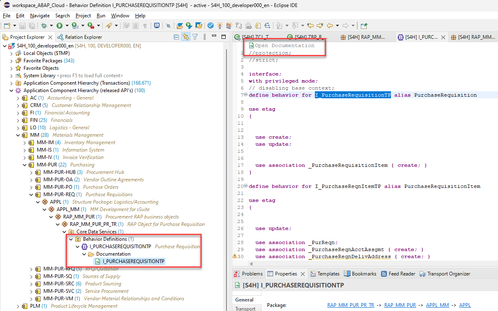 

  2. The **Knowledge Transfer Document** can also be opened directly via the **Open Development Object** dialogu that can be opened via the menu or via the short cut **Ctrl+Shift+A**.  

  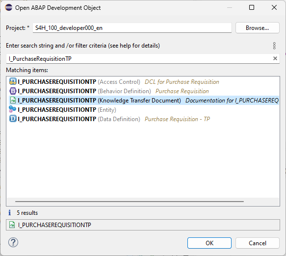 

  3. When you have opened the **Knowledge Transfer Document** you should change from the **Source** tab to the more appealing visualization of the **Preview** tab.  

  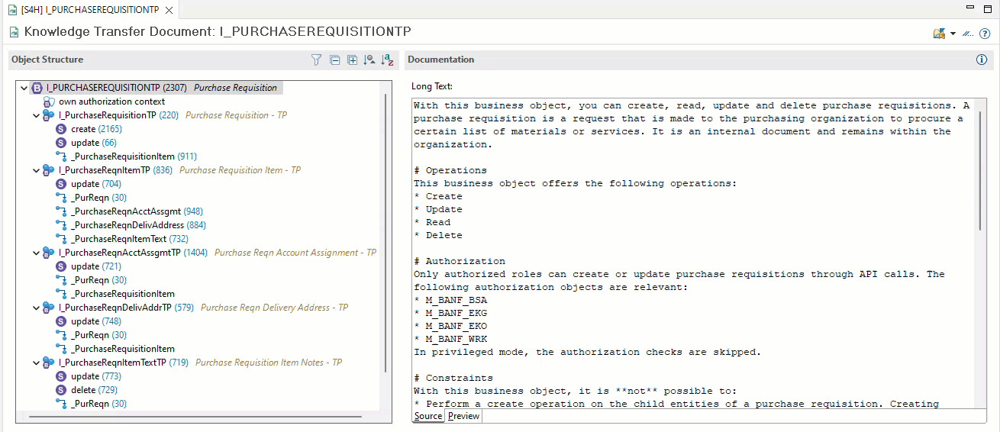  

  4. The **Knowledge Transfer Document** provides you with code snippets that help you to write code to perform the operation (e.g. *create* as shown below) or an action which is supported by this business object.  

  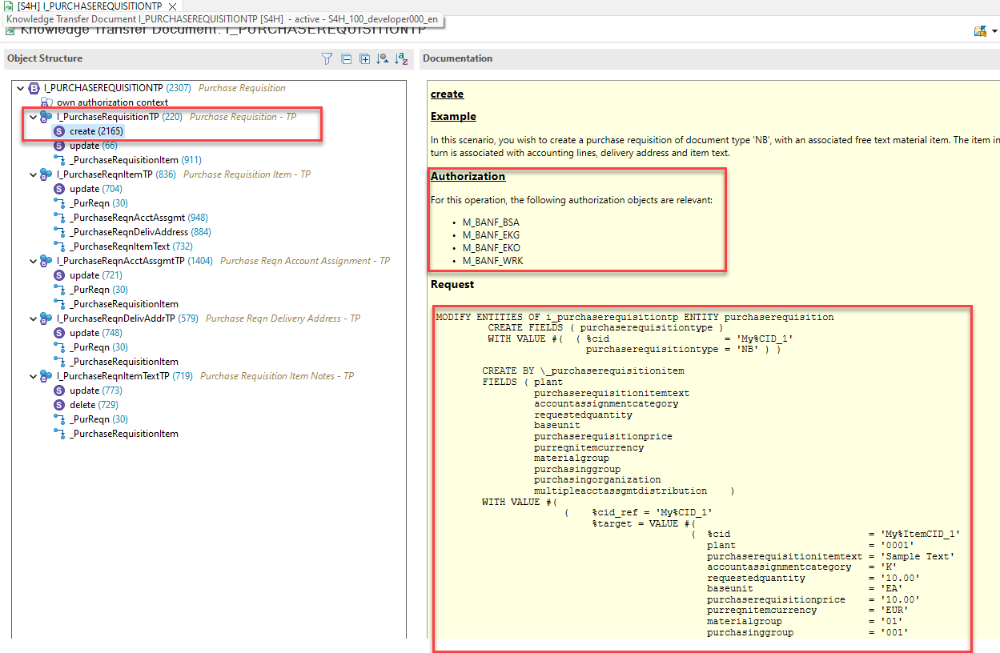     

We will use these code templates to create a test class that calls the API **I_PurchaseRequisitionTP** in order to create purchase requisitions in the following Excercise.

We will reuse this code in the implementation of the behavior definition class of our sample RAP business object **OnlineShop**. 

 
 

## Exercise 1.6: Implement a test class to call I_PurchaseRequisitionTP
[^Top of page](#)

In the preceeding exercise you have learned how to access the documentation of a released RAP business object.  

We will use this code to implement a test class that calls the API **I_PurchaseRequisitionTP** and that implements the interface **if_oo_adt_classrun** so we can start with basic tests by simply starting the `if_oo_adt_classrun~main( )` method of our test class by pressing **F9**.

The coding leverages the `response` parameter of EML statements that is used to specify response parameters for ABAP EML statements to get information on the following: 

- Failures, i. e. operations that could not get processed (FAILED failed_resp)   
- Key mapping information (MAPPED mapped_resp)   
- Returned error messages (REPORTED reported_resp)

By using the convert key command we are able to retrieve the semantic key that has been set by the purchase requisition API in the late numbering phase.   

<pre language=ABAP>
    COMMIT ENTITIES
      BEGIN RESPONSE OF i_purchaserequisitiontp
        FAILED DATA(failed_late)
        REPORTED DATA(reported_late).

        LOOP AT mapped-purchaserequisition ASSIGNING FIELD-SYMBOL(&lt;mapped&gt;).
          CONVERT KEY OF i_purchaserequisitiontp FROM &lt;mapped&gt;-%pid TO DATA(ls_ctr).
          &lt;mapped&gt;-PurchaseRequisition = ls_ctr-PurchaseRequisition.
        ENDLOOP.

        IF sy-subrc = 0.
          out->write( | PurchaseRequisition:  { ls_ctr-PurchaseRequisition } | ).
        ELSE.
          out->write( | Error PurchaseRequisition sy-subrc:  { sy-subrc } | ).
        ENDIF.
    COMMIT ENTITIES END.     
</pre>

See also the Development guide for the ABAP RESTful Application Programming Model, section [General RAP BO Implementation Contract](https://help.sap.com/docs/ABAP_PLATFORM_NEW/fc4c71aa50014fd1b43721701471913d/1040b81372d44ed38b07a409fa0e1769.html?locale=en-US&version=202210.000)  

 

  
Click to expand!

  1. Open the test class **zcl_test_i_purchase_req_###** that you have created before by pressing **Ctrl+Shift+A**.    

       

  2. Replace the code in the `if_oo_adt_classrun~main( )` method with the following code snippet.   

     📄 [source code main method](sources/main_test_class.txt)  

  3. Run the test class by pressing **F9**.  

       
     
     

 
 

## Summary 
[^Top of page](#)

Now that you've... 
- created an ABAP package that has ABAP language version *ABAP for Cloud Development*,
- created a class and have learned about the restrictions of *ABAP Cloud*,
- Implemented a simple test class for the released API **I_PurchaseRequisitionTP** ,

you can continue with the next exercise - **[Exercise 2: Implement the business logic of your RAP BO](../ex2/#readme)**.

> **Note:**   
> When your package and a starter project has already been generated in a SAP led workshop you can **skip Exercise 2** and you can continue with the third exercise - **[Exercise 3: Adapt the data model](../ex3/README.md)**.   
---

## Appendix
[^Top of page](#)

Find the source code for the repository objects in the [sources](sources) folder. Don't forget to replace all occurences of the placeholder `###` with your group ID.

-  [main method](sources/main_test_class.txt)
-  [Class zcl_test_i_purchase_req_###](sources/zcl_test_i_purchase_req_%23%23%23.txt)

