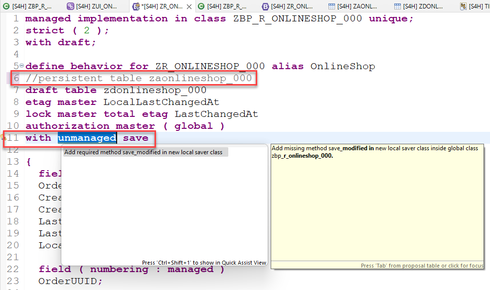
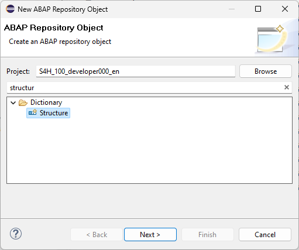
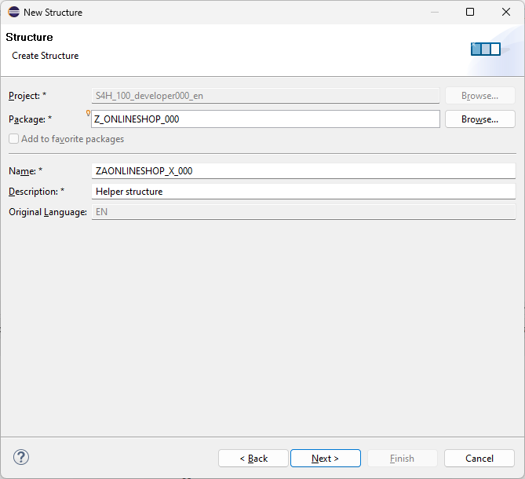
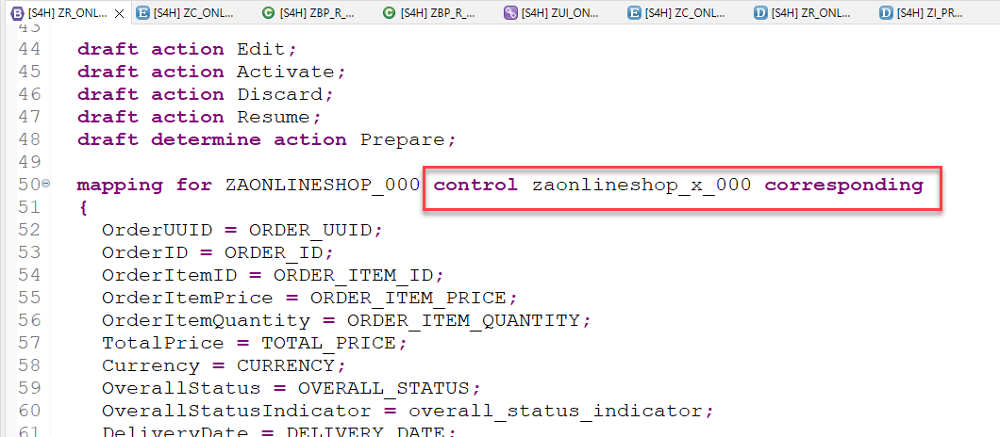
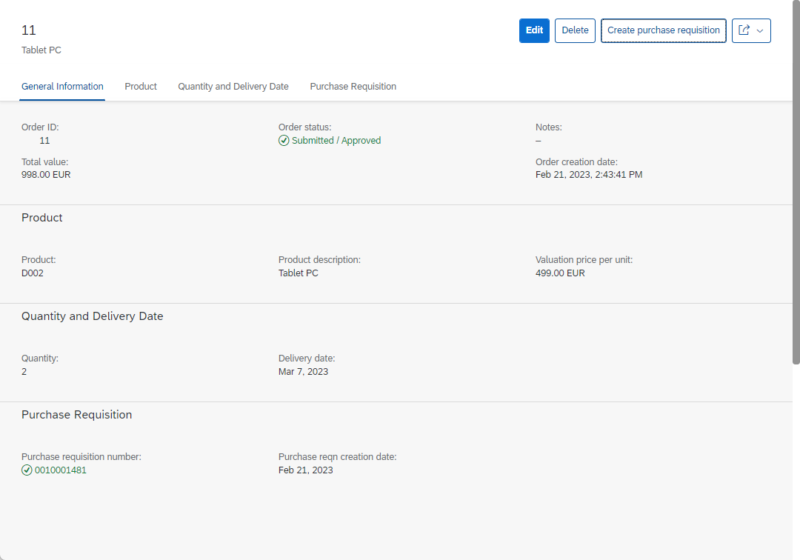

[Home - RAP610](../../../../#exercises)

# Exercise 4: Developer extensibility

## Introduction

In this exercise, you will implement calls to the released API so that the users of the OnlineShop App can create purchase requisitions using your RAP business object `ZR_ONLINESHOP_###`

- [4.1 - Add unmanaged save](#exercise-41-add-unmanaged-save)
- [4.2 - Add and implement an action](#exercise-42-add-and-implement-an-action)
- [4.3 - Check the results in the SAP standard Fiori App](#exercise-43-check-the-results-in-the-sap-standard-fiori-app)
- [Summary](#summary)
- [Appendix](#appendix)

## Exercise 4.1: Add variable to global BDEF class zbp_r_onlineshop_###
[^Top of page](#)

 The called **API I_PurchaserequisitionTP** uses late numbering. When being called by our application it will only return a preliminary key **%pid**.
 
 In order to retrieve the final key in our application from this preliminary key we have to use the `CONVERT KEY` key word:     
 
 <pre>
 CONVERT KEY OF i_purchaserequisitiontp FROM <fs_pr_mapped>-%pid TO DATA(ls_pr_key).
 </pre>
 
 Since this conversion routine can only be called within the **save sequence** in the **save_modified()** method we have to change the behavior of our RAP business object to use either **unmanaged save** or **additional_save**.   

 Since we want to write back into the persistence of our own RAP business object we **MUST** use the **unmanaged save** approach.   

And in order to transfer the mapped premliminary key(s) from the interaction phase into the save sequence we have to store that data in a variable that is accessible from both, the local handler and the local saver class. This can be achieved by defining an appropriate class variable in the global part of the behavior implementation class.   

 

  
Click to expand!

  
  We define a variable that will hold the response of our (to be implemented) API call in the behavior implementation class `zbp_r_onlineshop_###`.  

  <pre>

  CLASS zbp_r_onlineshop_### DEFINITION
  PUBLIC
  ABSTRACT
  FINAL
  FOR BEHAVIOR OF zr_onlineshop_### .

  PUBLIC SECTION.
    CLASS-DATA mapped_purchase_requisition TYPE RESPONSE FOR MAPPED i_purchaserequisitiontp.
  PROTECTED SECTION.
  PRIVATE SECTION.
  ENDCLASS.

  CLASS zbp_r_onlineshop_### IMPLEMENTATION.
  ENDCLASS.
  </pre>

 

## Exercise 4.2: Add unmanaged save
[^Top of page](#)

As mentioned above we have to add the use of an unmanaged save to the behavior of our RAP business object since the API that we plan to call uses *late numbering*.

Navigate to the behavior definition `ZR_ONLINESHOP_###` either in the *Project Explorer* or by opening it as a development object using the short cut **Ctrl+Shift+A**.   

 

  
Click to expand!

  1. Open the behavior definition and add the statement `with unmanaged save` right after the `authorization master ( global )` statement.   
     In addition uncomment the statement that specifies the persistent table of our RAP BO `//persistent table zaonlineshop_###` since it is not possible to use both statements in the same behavior definition.    
     
     > **Note:** 
     > When the code for your project has been pre-generated the behavior definition used an behavior implementation class on node level.  
     > For the **unmanaged save** a behavior implementation class has to be specified in the same line as the **managed** key word.
     > So you can replace the code as follows:    

<pre>
managed implementation in class ZBP_R_ONLINESHOP_### unique;
strict ( 2 );
with draft;

define behavior for ZR_ONLINESHOP_### alias OnlineShop
//implementation in class ZBP_R_ONLINESHOP_### unique
//persistent table zaonlineshop_###
draft table zdonlineshop_###
etag master LocalLastChangedAt
lock master total etag LastChangedAt
authorization master ( global )
with unmanaged save
</pre>

  2. Select the key word `unmanaged` and select **Ctrl + 1** to start the code assistant.   
     
     This will add a local saver class `lsc_zr_onlineshop_###` to the local classes of your behavior implementation class. The method `save_modified` is added to the DEFINITION and the IMPLEMENTATION section of this local class.   

     <pre>
     CLASS lsc_zr_onlineshop_### DEFINITION INHERITING FROM cl_abap_behavior_saver.
       PROTECTED SECTION.
       METHODS save_modified REDEFINITION.
     ENDCLASS.
     </pre>
     

    

  3. Implement the `save_modified()` method as follows:
  
<pre>
      METHOD save_modified.

    DATA : lt_online_shop_as        TYPE STANDARD TABLE OF zaonlineshop_###,
           ls_online_shop_as        TYPE                   zaonlineshop_###,
           lt_online_shop_x_control TYPE STANDARD TABLE OF zaonlineshop_x_###.

    IF create-onlineshop IS NOT INITIAL.
      lt_online_shop_as = CORRESPONDING #( create-onlineshop MAPPING FROM ENTITY ).
      INSERT zaonlineshop_### FROM TABLE @lt_online_shop_as.
    ENDIF.

    IF update IS NOT INITIAL.
      CLEAR lt_online_shop_as.
      lt_online_shop_as = CORRESPONDING #( update-onlineshop MAPPING FROM ENTITY ).
      lt_online_shop_x_control = CORRESPONDING #( update-onlineshop MAPPING FROM ENTITY ).
      MODIFY zaonlineshop_### FROM TABLE @lt_online_shop_as.
    ENDIF.
    IF delete IS NOT INITIAL.
      LOOP AT delete-onlineshop INTO DATA(onlineshop_delete).
        DELETE FROM zaonlineshop_### WHERE order_uuid = @onlineshop_delete-OrderUUID.
        DELETE FROM zdonlineshop_### WHERE orderuuid = @onlineshop_delete-OrderUUID.
      ENDLOOP.
    ENDIF.

  ENDMETHOD.

</pre>

  4. Create a structure `zaonlineshop_x_###`.

     - Right click on your package and select **New > Other ABAP Repository Object**  
     
     - Search for `Structure`

         
       
     - Enter the required values and press **Next**  

       Name: `ZAONLINESHOP_X_###`  
       Description: `Helper structure`  

       

     - Select a transport and press **Finish**  

     - Use the following code template

<pre>
  @EndUserText.label : 'Helper structure'
  @AbapCatalog.enhancement.category : #NOT_EXTENSIBLE
  define structure zaonlineshop_x_### {
  order_id              : abap_boolean;
  ordered_item          : abap_boolean;
  material_group        : abap_boolean;
  price                 : abap_boolean;
  total_price           : abap_boolean;
  currency              : abap_boolean;
  order_quantity        : abap_boolean;
  delivery_date         : abap_boolean;
  purchase_requisition  : abap_boolean;
  pr_status             : abap_boolean;
  pr_creation_date      : abap_boolean;
  notes                 : abap_boolean;
  created_by            : abap_boolean;
  created_at            : abap_boolean;
  last_changed_by       : abap_boolean;
  last_changed_at       : abap_boolean;
  local_last_changed_at : abap_boolean;
  }
</pre>

   - Activate the structure

   - Change the coding in your BDEF

     The statement `mapping for ZAONLINESHOP_###` must be changed to `mapping for ZAONLINESHOP_### control zaonlineshop_x_### corresponding`

     <pre>     
     mapping for ZAONLINESHOP_### control zaonlineshop_x_### corresponding
     </pre>

     

   - Activate your coding in local saver class in your behavior definition class

 

## Exercise 4.3: Add and implement an action
[^Top of page](#)

We have now prepared everything so that we can add an action to our RAP business object that will trigger the creation of a purchase requisition based on an order that has been placed in the OnlineShop.   

In the following you have to perform the following steps 

- Add the action `createPurchaseRequisition` to the behavior definition 
- Implementation of the method `createPurchaseRequisition` in your behavior implementation class   
- Enable action in the behavior definition projection 
- Add UI annotations in the metadata extension file to make the action button visible in your Fiori Elements application

 

  
Click to expand!

1. Open the behavior definition

2. Add the following statement in your BDEF

   <pre>
   action createPurchaseRequisition result [1] $self;
   </pre>

3. Click on the action name and press **Ctrl+1** to start the quick assist

   This will add the following method to the local handler class of your behavior definition which will be executed when the button of our action is pressed.  
   
   <pre>
   METHODS createPurchaseRequisition FOR MODIFY
      IMPORTING keys FOR ACTION OnlineShop~createPurchaseRequisition RESULT result.
   </pre>

4. Implementation of method `createPurchaseRequisition` 
   
   The implementation of the method `createPurchaseRequisition` reuses large parts of the coding that we have used in the test class in **Exercise 1**.  
  
   In the implementation we first fill some internal tables that serve as a payload for the EML call that will create one or more purchase requisitions.  
   The preliminary id %pid that is returned via the mapped table from the API that was called is stored in a variable in the global behavior implementation class.  
   
   <pre>zbp_r_onlineshop_###=>mapped_purchase_requisition-purchaserequisition = mapped_create_pr-purchaserequisition.</pre>  
   
   The code then updates the fields `OverallStatus`, `OverallStatusIndicator` and `PurchRqnCreationDate` of our RAP business object. This way it is also ensured that the save_sequence is triggered where the `CONVERT KEY` statement is used to retrieve the final key, the `PurchaseRequisitionID`.  
   
   The action finally returns via the return return parameter a table of UUID based keys of OnlineShop entities that have been processed.  
   
    
  <pre>
  METHOD createPurchaseRequisition.

    DATA: purchase_requisitions      TYPE TABLE FOR CREATE I_PurchaserequisitionTP,
          purchase_requisition       TYPE STRUCTURE FOR CREATE I_PurchaserequisitionTP,
          purchase_requisition_items TYPE TABLE FOR CREATE i_purchaserequisitionTP\_PurchaseRequisitionItem,
          purchase_requisition_item  TYPE STRUCTURE FOR CREATE i_purchaserequisitiontp\\purchaserequisition\_purchaserequisitionitem,
          purchase_reqn_acct_assgmts TYPE TABLE FOR CREATE I_PurchaseReqnItemTP\_PurchaseReqnAcctAssgmt,
          purchase_reqn_acct_assgmt  TYPE STRUCTURE FOR CREATE I_PurchaseReqnItemTP\_PurchaseReqnAcctAssgmt,
          purchase_reqn_item_texts   TYPE TABLE FOR CREATE I_PurchaseReqnItemTP\_PurchaseReqnItemText,
          purchase_reqn_item_text    TYPE STRUCTURE FOR CREATE I_PurchaseReqnItemTP\_PurchaseReqnItemText,
          update_lines               TYPE TABLE FOR UPDATE ZR_OnlineShop_###\\OnlineShop,
          update_line                TYPE STRUCTURE FOR UPDATE ZR_OnlineShop_###\\OnlineShop,
          purchase_order_description TYPE c LENGTH 40.

    "read transfered order instances
    READ ENTITIES OF ZR_OnlineShop_### IN LOCAL MODE
      ENTITY OnlineShop
        ALL FIELDS WITH
        CORRESPONDING #( keys )
      RESULT DATA(OnlineShops).

    "delete instances with assigned purchase rqn number
    DELETE OnlineShops WHERE PurchaseRequisition IS NOT INITIAL.
    CHECK OnlineShops IS NOT INITIAL.

    DATA n TYPE i.
    LOOP AT OnlineShops INTO DATA(OnlineShop).
      n += 1.

      purchase_order_description = | { sy-uname } - { OnlineShop-OrderID  } |.

      "purchase requisition
      purchase_requisition = VALUE #(  %cid                      = |My%CID_{ n }|
                                        purchaserequisitiontype  = 'NB'
                                        PurReqnDescription = purchase_order_description
                                         ) .
      APPEND purchase_requisition TO purchase_requisitions.

      "purchase requisition item
      purchase_requisition_item = VALUE #(
                                         %cid_ref = |My%CID_{ n }|
                                         %target  = VALUE #(  (
                                                       %cid                         = |My%ItemCID_{ n }|
                                                       plant                        = '1010'  "Plant 01 (DE)
                                                       accountassignmentcategory    = 'U'  "unknown
*                                                       PurchaseRequisitionItemText  = OnlineShop-ProductText.  "info automatically retrieved from I_Product
                                                       requestedquantity            = OnlineShop-OrderItemQuantity
                                                       baseunit                     = OnlineShop-BaseUnit
                                                       purchaserequisitionprice     = OnlineShop-OrderItemPrice
                                                       purreqnitemcurrency          = OnlineShop-Currency
                                                       Material                     = OnlineShop-OrderItemID
                                                       materialgroup                = OnlineShop-ProductGroup
                                                       purchasinggroup              = '001'
                                                       purchasingorganization       = '1010'
                                                       DeliveryDate                 = OnlineShop-DeliveryDate   "format: yyyy-mm-dd (at least 10 days)
                                                       ) ) ).
      APPEND purchase_requisition_item TO purchase_requisition_items.

      "purchase requisition account assignment
      purchase_reqn_acct_assgmt = VALUE #(
                                           %cid_ref = |My%ItemCID_{ n }|
                                           %target  = VALUE #( (
                                                        %cid       = |My%AccntCID_{ n }|
                                                        CostCenter = 'JMW-COST'
                                                        GLAccount  = '0000400000' ) ) ) .
      APPEND purchase_reqn_acct_assgmt TO purchase_reqn_acct_assgmts .

      "purchase requisition item text
      purchase_reqn_item_text =  VALUE #(
                                          %cid_ref = |My%ItemCID_{ n }|
                                          %target  = VALUE #( (
                                                       %cid           = |My%TextCID_{ n }|
                                                       textobjecttype = 'B01'
                                                       language       = 'E'
                                                       plainlongtext  = OnlineShop-Notes
                                                   )  )  ) .
      APPEND purchase_reqn_item_text TO purchase_reqn_item_texts.
    ENDLOOP.

    "create the purchase requisitions
    IF OnlineShops IS NOT INITIAL.
      "purchase requisition
      MODIFY ENTITIES OF i_purchaserequisitiontp
        ENTITY purchaserequisition
          CREATE FIELDS ( purchaserequisitiontype )
          WITH purchase_requisitions
        "purchase requisition item
        CREATE BY \_purchaserequisitionitem
          FIELDS ( plant
                   accountassignmentcategory
*                   purchaserequisitionitemtext
                   requestedquantity
                   baseunit
                   purchaserequisitionprice
                   purreqnitemcurrency
                   Material
                   materialgroup
                   purchasinggroup
                   purchasingorganization
                   DeliveryDate
                )
        WITH purchase_requisition_items
      "purchase reqn account assignment
      ENTITY purchaserequisitionitem
        CREATE BY \_purchasereqnacctassgmt
            FIELDS ( CostCenter
                     GLAccount
                     Quantity
                     BaseUnit )
            WITH purchase_reqn_acct_assgmts
        "purchase reqn item text
        CREATE BY \_purchasereqnitemtext
            FIELDS ( plainlongtext )
            WITH purchase_reqn_item_texts
      REPORTED DATA(reported_create_pr)
      MAPPED   DATA(mapped_create_pr)
      FAILED   DATA(failed_create_pr).
    ENDIF.

    "retrieve the generated
    zbp_r_onlineshop_###=>mapped_purchase_requisition-purchaserequisition = mapped_create_pr-purchaserequisition.

    "set a flag to check in the save sequence that purchase requisition has been created
    "the correct value for PurchaseRequisition has to be calculated in the save sequence using convert key
    LOOP AT keys INTO DATA(key).
      IF line_exists( onlineshops[ OrderUUID = key-OrderUUID ] ).
*        update_line-DirtyFlag              = abap_true.
        update_line-%tky                   = key-%tky.
        update_line-OverallStatus          = c_overall_status-submitted. "'Submitted / Approved'.
        update_line-OverallStatusIndicator = c_overall_status-submitted_code. "3.
        update_line-PurchRqnCreationDate   = cl_abap_context_info=>get_system_date(  ).
        APPEND update_line TO update_lines.
      ENDIF.
    ENDLOOP.

    MODIFY ENTITIES OF ZR_OnlineShop_### IN LOCAL MODE
      ENTITY OnlineShop
        UPDATE
*        FIELDS ( DirtyFlag OverallStatus OverallStatusIndicator PurchRqnCreationDate )
        FIELDS ( OverallStatus OverallStatusIndicator PurchRqnCreationDate )
        WITH update_lines
      REPORTED reported
      FAILED failed
      MAPPED mapped.

    IF failed IS INITIAL.
      "Read the changed data for action result
      READ ENTITIES OF ZR_OnlineShop_### IN LOCAL MODE
        ENTITY OnlineShop
          ALL FIELDS WITH
          CORRESPONDING #( keys )
        RESULT DATA(result_read).
      "return result entities
      result = VALUE #( FOR result_order IN result_read ( %tky   = result_order-%tky
                                                          %param = result_order ) ).
    ENDIF.

  ENDMETHOD.
  </pre> 

5. Enable action in the projection view

   Add the following code in your projection BDEF. 

   <pre>
   use action createPurchaseRequisition;
   </pre>

6. Make the action visible by uncommenting the following lines in your meta data extension file

<pre>
  @UI.lineItem:       [{ position: 84, label: 'Purchase requisition nbr.', importance: #HIGH },
            { type: #FOR_ACTION, dataAction: 'createPurchaseRequisition', label: 'Create purchase requisition' } ] //Submit Order | Create purchase requisition|
  @UI.identification: [
                       { type: #FOR_ACTION, dataAction: 'createPurchaseRequisition',
                         label: 'Create purchase requisition' }]  //Submit Order | Create purchase requisition|
  @UI.fieldGroup: [{ qualifier: 'PurchReq', position: 22, label: 'Purchase requisition number' }]  //PurchReq
  PurchaseRequisition;
</pre>
  
 
> **Note**
> 7. Before checking the results in the ADT Fiori Elements preview make sure to clear the cache by pressing **F12** and by selecting **clear cache and refresh**. Otherwise you might run into the issue that the button of the action is visible but not functional.   

  

## Exercise 4.4: Check the results in the SAP standard Fiori App
[^Top of page](#)

We can use the app **Manage Purchase Requisition - Professional** to check the purchase requistions that you have created using your custom RAP business object.   

 

  
Click to expand!

 In a preconfigured appliance system the app can be started using the local Fiori Launchpad.
 
  https://xxx.xxx.xxx.xxx:44301/sap/bc/ui2/flp?sap-client=100&sap-language=EN#PurchaseRequisition-maintain

  **Fiori Elements Preview**   
    
 
  **Manage Purchase Requistion - SAP standard application**   
    
 
 
 

